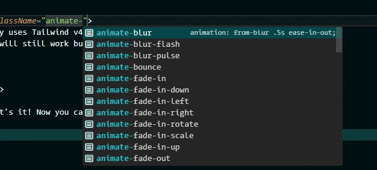

import { Image } from "astro:assets";
import intellisense from "../../assets/media/projects/animated/Intellisense.webp";
import thumbnail from "../../assets/media/projects/animated/thumbnail.webp";

I was tired of copying animation keyframes between projects. Every new codebase started with the same paste: fade-in, slide-up, blur-in, bounce. Always slightly different. Always untested.

So I packaged them properly.

**Animated** is a Tailwind CSS 4 plugin with 75+ handcrafted CSS animations. One import, zero JavaScript, works in any framework.

<figure>
  <Image src={thumbnail} alt="Animated - CSS animations for Tailwind CSS 4" class="rounded-xl show-animation" width={800} height={500} />
  <figcaption>The Animated documentation site - every animation previewed live.</figcaption>
</figure>

---

## Installation

```sh
pnpm add @polgubau/animated
```

```css
/* index.css */
@import "tailwindcss";
@import "@polgubau/animated";
```

That's it. No config, no plugin registration, no JavaScript.

## Usage

```html
<div class="animate-fade-in">Fades in on mount</div>
<div class="animate-slide-up">Slides up on mount</div>
<div class="animate-blur-in animate-delay-300">Blur in, 300ms delay</div>
```

Full IntelliSense support in VS Code and any TypeScript-aware editor:

<figure>
  <Image src={intellisense} alt="IntelliSense showing animation class suggestions" class="rounded-xl show-animation" width={800} height={400} />
  <figcaption>Autocomplete works out of the box - no extra setup needed.</figcaption>
</figure>

## Without Tailwind

Works standalone too. Import the CSS and use the keyframes directly:

```css
import '@polgubau/animated';

.my-element {
  animation: slide-in-top 0.4s ease-out;
}
```


## 📋 Available Animations

@polgubau/animated provides a variety of CSS animations categorized into different groups:

- **Blur**: 
  - animate-blur 
  - animate-blur-pulse
  - animate-blur-flash
  - ...

- Fade 
  - animate-fade-in
  - animate-fade-out
  - animate-fade-pulse
  - ...

- Grow
  - animate-grow
  - animate-grow-pulse
  - ...

- Pump
  - animate-pump
  - animate-pump-pulse
  - ...

- Shake
  - animate-shake-x
  - animate-shake-y
  - ...

- Slide
  - animate-slide-left
  - animate-slide-right
  - animate-slide-up
  - animate-slide-down
  - ...

- Wiggle
  - animate-wiggle
  - ...

- Flip
  - animate-flip-x
  - animate-flip-y
  - animate-flip-pulse
  - ...

- Roll
  - animate-roll-left
  - animate-roll-right
  - animate-roll-pulse
  - ...

These are just some examples, the library has +75 animations to use in your project.
*(More categories coming soon!)*

## ⚡ Customization

You can customize animation durations and other properties using Tailwind's utility classes:

```html
<div class="animate-slide-left duration-1000 ease-in-out">
  Sliding effect!
</div>
```

## Configuration
To make it easier to configure, the animations are based in predefined css variables. You can change the default values by overriding the variables in your CSS.

These are the default values:

```css
:root {
  --smaller-scale: 0.8;
  --larger-scale: 1.2;
  --pump-amount: 1.1;
  --pump-soft-amount: 1.05;
  --pump-hard-amount: 1.2;
  --pump-x-amount: 1.1;
  --pump-y-amount: 1.1;
  --pump-bounce-amount: 1.15;
  --blur-amount: 8px;
  --slide-amount: 20px;
  --slide-amount-negative: calc(-1 * var(--slide-amount));
  --rotation: 10deg;
  --rotation-negative: calc(-1 * var(--rotation));
  --small-rotation: calc(0.5 * var(--rotation));
  --small-rotation-negative: calc(-1 * var(--small-rotation));
  --shake-amount: 5px;
  --shake-amount-negative: calc(-1 * var(--shake-amount));
  --movement-distance: 10px;
  --fade-scale: 0.95;
  --rolled-degree: 360deg;
  --rolled-degree-negative: calc(-1 * var(--rolled-degree));
  --rolled-distance: 100%;
  --rolled-distance-negative: calc(-1 * var(--rolled-distance));
}
```
Simply override these values in your main CSS file under the library import to personalize your animations.

```css
/* index.css */
@import "tailwindcss";
@import "@polgubau/animated";

:root {
  --slide-amount: 40px;
}
```
*Now all slide animations will slide 40px instead of the default 20px! 😎*

## How Can I See the Available Animations? 🔍

You can simply type `animate-` and you'll see all available animations in your editor.



> This will work automatically if you have your Tailwind extension installed in your IDE.

### But I Want to Access Them Dynamically 💡

The library exports an array of all animations in JSON format:

```ts
import animations from "@polgubau/animated/summary";

/* [
  "animate-blur",
  "animate-blur-flash",
  "animate-blur-pulse",
  ...
] */
```

*You can use this array however you like. TIP: This is useful for creating dynamically animated UI components based on props. 🌟*

## I'm Not Using Tailwind 🚫

**@polgubau/animated** is fully compatible with any CSS framework or vanilla CSS. Just import the library in your main CSS file:

```tsx
/* index.tsx */
import "@polgubau/animated";
```

You'll now have access to all keyframe animations, but remember you'll need to create the classes manually.

```css
.fade-in {
  animation: 3s infinite alternate slide-in-top;
}
```

---

## Explore the Animations 🌟

Now that you know how to use the library, dive into the animations! Use the sidebar to explore different categories and see them in action. Enjoy! 🎉

---

## Documentation 📝

The documentation is built using a **monorepo with Vite and React**. It uses **TailwindCSS** and features **fully dynamic animations**, meaning they are loaded directly from the package and not prebuilt into the documentation itself.
